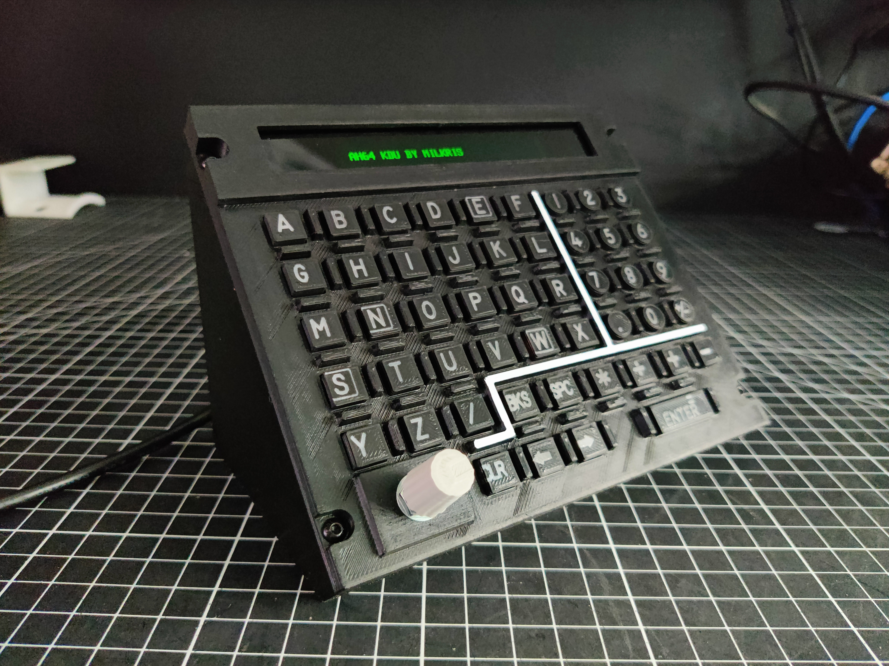

Demo: https://youtube.com/shorts/2huMgZh5P64

Here is my KDU (Keyboard Display Unit) for the DCS AH-64D Apache. The project includes files for 3D printing, laser engraving of the button labels, and, of course, the Arduino code.

You can switch the display source from Pilot to CP/Gunner by pressing a button. This button is wired to PIN 7. I integrated this function into the push-button of the rotary encoder for the KU Scratchpad Brightness Knob.

The project is still a Work in Progress (WIP).I engraved the labels with a laser, but I will add another version of the button STLs where the labels are raised so they can be printed directly with a 3D printer.

I used an Arduino UNO and an SSD1322 OLED display with an SPI interface.

Make sure to use the latest version of DCS-BIOS Skunkworks.

There is also a How-To.pdf for details!

SSD1322 SPI OLED: https://www.amazon.de/OLED-Display-SSD1322-Grafik-LCD-Modul-Parallel-L%C3%B6tstift-wei%C3%9F/dp/B0DQ52MRX1?source=ps-sl-shoppingads-lpcontext&ref_=fplfs&psc=1&smid=A9KVXEOZANNPE
